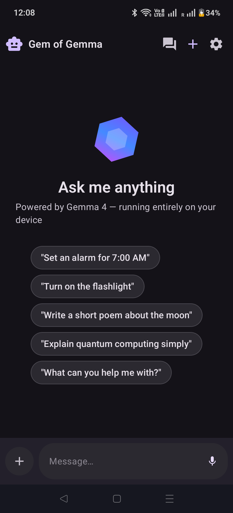
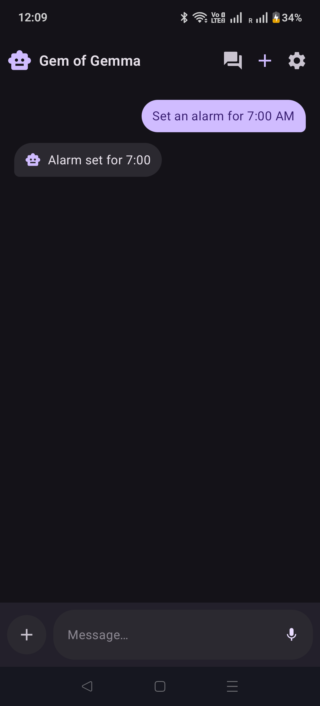
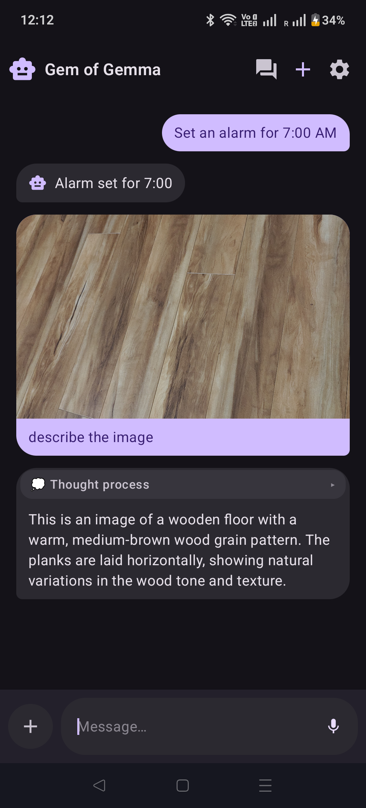
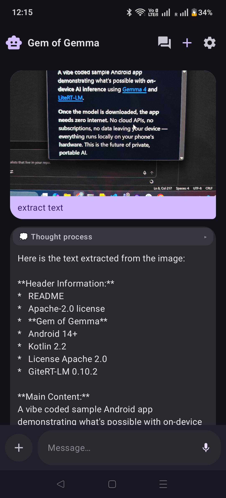
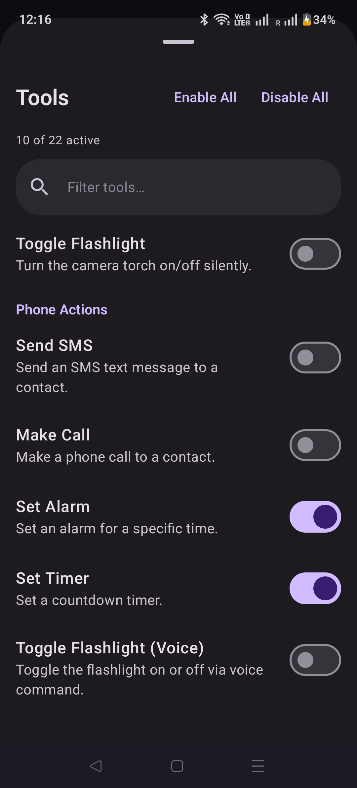

# Gem of Gemma 💎


A vibe coded sample Android app demonstrating what's possible with **on-device AI inference** using [Gemma 4](https://blog.google/technology/developers/gemma-4/) and [LiteRT-LM](https://ai.google.dev/edge/litert-lm).

**Once the model is downloaded, the app needs zero internet.** No cloud APIs, no subscriptions, no data leaving your device — everything runs locally on your phone's hardware. This is the future of private, portable AI.

## 📸 Screenshots

<p align="center">
  
  
  
</p>
<p align="center">
  
  
</p>

## What It Can Do

- **Chat** — Natural conversation with real-time token streaming and visible thinking/reasoning
- **See** — Understand images from camera or gallery: describe scenes, detect objects with bounding boxes, read text (OCR), answer visual questions
- **Control your phone** — 22 tools via native function calling: send SMS, make calls, set alarms, toggle flashlight, adjust volume/brightness, navigate, control media, and more

## Getting Started

```bash
git clone https://github.com/AjaySainy/GemOfGemma.git
cd GemOfGemma
./gradlew installDebug
```

**Requirements:** Android Studio, JDK 17+, Android device with 4GB+ RAM, ~3GB storage.

On first launch, the app downloads the Gemma 4 model from HuggingFace (~2.5 GB, one-time). After that, it's fully offline.

## Model License

The Gemma model is subject to the [Gemma Terms of Use](https://ai.google.dev/gemma/terms). This project's source code is [Apache 2.0](LICENSE).

## Contributing

Contributions welcome — open an issue first to discuss, then submit a PR.

## Acknowledgments

[Google DeepMind](https://deepmind.google/) (Gemma) · [Google AI Edge](https://ai.google.dev/edge) (LiteRT-LM) · [Jetpack Compose](https://developer.android.com/compose)
